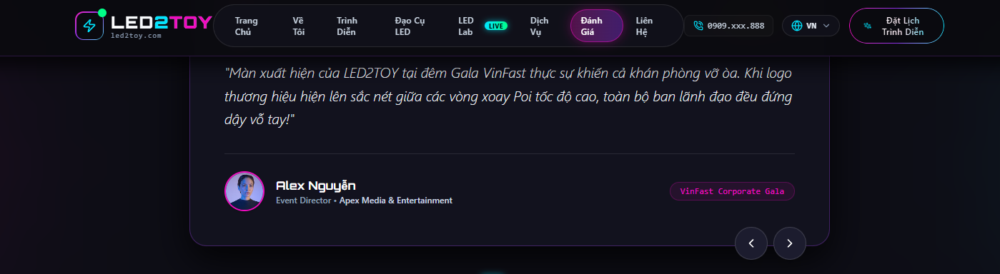

****# NCTA — project rules

Single-page React 19 + TypeScript + Vite + Tailwind v4 marketing site (ncta.vn).

## Responsive / mobile (must-follow)

The site is viewed heavily on phones and tablets. **Never introduce horizontal
overflow.** After any layout change, verify there is no horizontal scrollbar in
portrait at iPhone (~375–430px) and iPad (~768–834px) widths.

- Any element/section that holds **absolutely-positioned decorations** (neon
  glows, blurred orbs, light streaks — often with negative offsets like
  `-left-32`, `-right-32`, `w-96`, `blur-[140px]`) **must also carry
  `overflow-hidden`** so the decoration is clipped and cannot widen the page.
- Keep the global overflow guard in `src/index.css`
  (`html, body { overflow-x: clip }` + `body { width:100%; max-width:100% }`).
  Do not delete it without an equivalent replacement.
- Prefer `overflow-x: clip` over `overflow-x: hidden` on `html`/`body` (clip does
  not create a scroll container).
- Avoid `w-screen` / `100vw` (they include the scrollbar width and overflow on
  desktop); use `w-full` / `max-w-full`.
- **Horizontal swipe strips** (`overflow-x-auto`): never combine with
  `justify-center` — when the content overflows, centering pushes the first
  item off the left edge and it becomes unreachable by scrolling. Use
  `justify-start` (add `lg:justify-center` to center only once it fits), give
  items `shrink-0`, add horizontal padding, and hide the bar with
  `.scrollbar-none` (defined in `index.css`). Optionally `snap-x` + `snap-start`.
- Build mobile-first: default classes target phones, add `sm:`/`md:`/`lg:` for
  larger screens.

## Performance (landing page / Lighthouse)

- **Measure only against the production build** (`npm run build` then
  `npx vite preview`). `npm run dev` (port 3000) has NO prerender and serves
  dev React — Lighthouse numbers there are meaningless (LCP inflated 5–10×).
- **Section code-splitting contract** (`App.tsx`): every below-the-fold section
  is a `lazySection()` chunk wrapped in `<Suspense>` with a `SectionShell`
  fallback that keeps the anchor `id`. The static prerender stays complete
  because `entry-server.tsx` awaits `preloadAppSections()` before
  `renderToString`. New sections must follow the same pattern; after touching
  this area verify `dist/index.html` still contains the full section markup
  (grep deep content, not just ids — fallback shells carry ids too).
- **Scroll-driven hydration contract** (`App.tsx` `useScrollDrivenSections`):
  on the client a section's chunk is NOT downloaded at hydration — the import is
  gated until its anchor scrolls within ~600px (IntersectionObserver), then an
  idle sweep prefetches the rest. While the gate is closed the `React.lazy`
  stays pending and React keeps the prerendered server HTML (selective
  hydration — depends on the `<!--$-->` Suspense boundary markers `renderToString`
  emits; don't switch the prerender to a mode that drops them). New sections MUST
  pass their anchor `id` as the 2nd arg to `lazySection(load, id)` — an id-less
  section only ever hydrates during the idle sweep, never on scroll.
- **Boot splash dismissal contract** (`index.html` inline script):
  phones/tablets (coarse pointer) reveal the page as soon as the DOM is parsed
  (`readystatechange`); desktop waits for React's hydration signal
  (`window.__nctaDismissBoot`, called from an `App.tsx` mount effect). Safety
  timeouts guard both. Do not re-tie dismissal to window `load`.
- **Mobile hydration is deferred to idle** (`main.tsx`, `requestIdleCallback`
  on coarse pointer) — the prerendered HTML is readable immediately; hydration
  must never block first scroll. Language changes wrap `setLangState` in
  `startTransition` (`LanguageContext.tsx`) so not-yet-hydrated Suspense
  boundaries keep their server HTML instead of client re-rendering.
- Below-fold sections also get `content-visibility: auto` via
  `main > section:nth-of-type(n + 2)` in `index.css` — keep new sections as
  direct `<section>` children of `<main>`.
- Canvas `requestAnimationFrame` loops must NOT run unconditionally: throttle
  (~30fps for ambient FX), skip drawing when `document.hidden`, pause when the
  canvas is off-screen (IntersectionObserver), and bail entirely on
  `prefers-reduced-motion`. On coarse-pointer devices the ambient canvas is
  disabled outright. See `FlowCanvas.tsx`.
- Scroll handlers must never read layout (`offsetTop`/`offsetHeight`) per
  event — use passive + rAF-throttled listeners and IntersectionObserver
  instead (see `Navbar.tsx`).
- Images: `loading="lazy"` + `decoding="async"` on all non-LCP images; Unsplash
  images add `srcSet={unsplashSrcSet(url)}` + `sizes` (`src/utils/images.ts`)
  so phones download ~480px files. Keep the aspect-ratio wrappers so there is
  no CLS. `preconnect` to external image/font hosts in `index.html`; load
  Google Fonts non-render-blocking (`media=print` swap trick + `<noscript>`
  fallback).

## Show article pages (multi-page build)

Every performance also has a **standalone static page** at `/show/<id>/`,
linked from the portfolio card and the summary popup ("Chi tiết").

- The build is a 2-input Vite MPA: `index.html` + `show.html` (a template whose
  head carries a `<!--SHOW_HEAD-->` marker). `scripts/prerender.mjs` stamps one
  copy per show into `dist/show/<id>/index.html` with per-show title,
  description, canonical, OG tags and Article/BreadcrumbList JSON-LD, then
  deletes `dist/show.html` so the bare template is never indexed.
- The same script **regenerates `dist/sitemap.xml`** (home + every show URL).
  Do not hand-add show URLs to `public/sitemap.xml`.
- `npm run dev` has no prerender, so a middleware in `vite.config.ts` rewrites
  `/show/<id>/` → `show.html?show=<id>`; `resolveShowId()` in `ArticleApp.tsx`
  reads either form.
- **Adding an article touches two files**: the content in
  `src/data/showArticles.ts` AND the slug in `src/data/showArticleIds.ts`.
  The split keeps the landing page from downloading article prose it never
  shows — never import `showArticles.ts` from a landing-page component. A
  DEV-only check warns when the two lists drift.
- Article pages are intentionally NOT `lazySection()`-split (one continuous
  read) and skip `FlowCanvas`. They use `ArticleNavbar` because the home
  `Navbar` scroll-spies over landing sections that do not exist here, and
  `<Footer hrefBase="/">` so its anchors point back at the home page.

## Internationalization

- Bilingual **Vietnamese (default) + English** via a lightweight custom i18n
  context: `src/i18n/{config,translations,LanguageContext}.tsx`.
- UI strings live in `src/i18n/translations.ts` (`en` is typed `typeof vi`, so
  both languages must share the exact same keys).
- Content data (props, shows, services…) is localized in `src/data/mockData.ts`
  as `{ vi, en, zh? }` leaves, exposed via `get*(lang)` getters. Components read
  data through those getters, not static imports.
- **Chinese (中文)** is a planned addition (shown as "Soon" in the switcher). To
  ship it: add `'zh'` to `Lang` in `config.ts`, set `enabled: true`, add a `zh`
  branch in `translations.ts`, and fill `zh` on each leaf in `mockData.ts`.

## Verify

- Type-check: `npm run lint` (runs `tsc --noEmit`).
- Build: `npm run build`. Dev: `npm run dev` (port 3000).
